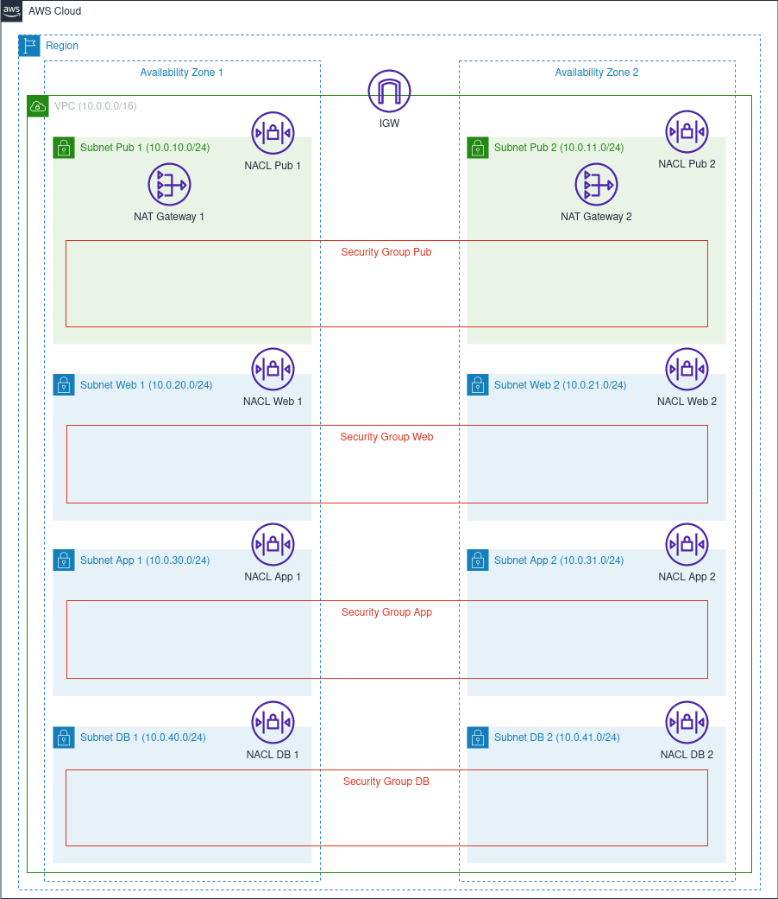

# Multi-AZ VPC CloudFormation Template
The [cfn-multi-az-vpc.yaml](./cfn-multi-az-vpc.yaml) template creates the network resources for a virtual private cloud (VPC) with public access, web, application, and database tiers.  Components include an internet gateway (IGW) and redundant NAT gateways; public and private subnets spread over two Availability Zones (AZ), with route tables for each subnet; network access control lists (NACL) to secure inbound and outbound subnet traffic; and security groups for the instances in each tier.

The architectural diagram below shows the resources created by the template.



Before launching the template, review the resources that will be created, as the NAT gateways are not free tier eligible. Please refer to the [Amazon VPC Pricing](https://aws.amazon.com/vpc/pricing/) page for specific regional pricing.  

## Template Overview
The [cfn-multi-az-vpc.yaml](./cfn-multi-az-vpc.yaml) template creates the AWS resources described below.

### VPC
One (1) VPC, spanning across two AZs (AZ1 and AZ2), is generated. The VPC contains all of the network resources created by the template.

Traffic flow is designed with the expectation that bastion hosts and load balancers will be placed in the public access tier subnets; EC2 instances, EKS clusters, or Lambda functions in the web and application tier subnets; and RDS MySQL instances in the database tier subnets.

### IGW and NAT Gateways 
The template creates one (1) IGW, which enables resources in the public subnets to reach the internet. To provide internet access for the private subnets, two (2) NAT gateways are created, with one (1) placed in each AZ for redundancy. 

### Public and Private Subnets
Two (2) public subnets are created, one (1) in each AZ. Six (6) private subnets are generated, two (2) in each of the web, application, and database tiers, spread across the two (2) AZs. 

To control traffic flow, route tables are created for each subnet. The route tables for the public access subnets each contain a route to the IGW, while the route tables for the web and application tier subnets each contain a route to the NAT gateway in their respective AZ. The route tables for the database tier subnets do not contain routes to the NAT gateway, primarily because hosted services such as AWS RDS do not require internet access for updates. These initial routes should be modified as circumstances dictate.


### NACLs
Eight (8) NACLs are configured to limit ingress and egress only to adjacent tier subnets in the same AZ. For example, Subnet App 1 can only send and receive traffic to and from Subnet Web 1 and Subnet DB 1. Ingress and egress are restricted by IP range and port.

For Subnet Pub 1 and Subnet Pub 2, ingress and egress outside the VPC is currently restricted to a placeholder private IP address range (192.168.0.0/16) on SSH port 22. If public facing resources are added to these subnets, such as bastion hosts or load balancers, the allowed IP ranges and ports should be updated accordingly.

### Security Groups
A total of four (4) security groups are generated. Each security group functions as a firewall for the instances in each tier of subnets, limiting ingress and egress to instances in adjacent tier security groups.

For example, the application tier security group (Security Group App) allows ingress traffic only on port 443 from instances in the web tier security group (Security Group Web). Egress is limited to port 3306 traffic destined for instances in the database tier security group (Security Group DB). Because security groups are stateful, response traffic is allowed for each of these rules.

## List of Parameters
The template parameters, listed below, can be modified as necessary to fit within the design of the AWS account. The CIDR block ranges, for example, can be changed if required to avoid matching or overlapping blocks when peering VPCs. The default parameter values can be updated directly in the CloudFormation template, through the AWS Console when creating the stack, or via customizing the [parameters.json](./parameters.json) file if using the AWS CLI.

|Parameter|Description|Default Value|
|---------|-----------|-------------|
|EnvironmentName|Environment name used by CloudFormation to identify each resource.|Project001|
|VPCCIDR|CIDR block of the VPC.|10.0.0.0/16|
|SubnetPub1CIDR|CIDR block of the public access subnet in AZ1.|10.0.10.0/24|
|SubnetPub2CIDR|CIDR block of the public access subnet in AZ2.|10.0.11.0/24|
|SubnetWeb1CIDR|CIDR block of the private subnet for web servers in AZ1.|10.0.20.0/24|
|SubnetWeb2CIDR|CIDR block of the private subnet for web servers in AZ2.|10.0.21.0/24|
|SubnetApp1CIDR|CIDR block of the private subnet for application servers in AZ1.|10.0.30.0/24|
|SubnetApp2CIDR|CIDR block of the private subnet for application servers in AZ2.|10.0.31.0/24|
|SubnetDB1CIDR|CIDR block of the private subnet for database servers in AZ1.|10.0.40.0/24|
|SubnetDB2CIDR|CIDR block of the private subnet for database servers in AZ2.|10.0.41.0/24|

## Stack Output Values
The stack exports the names of the VPC, subnets, and security groups, which can then be referenced by stacks that create other resources, such as EC2 instances.

|Output|Description|
|---------|-----------|
|VPC|Reference to the created VPC.|
|SubnetPub1|Reference to the public access subnet in AZ1.|
|SubnetPub2|Reference to the public access subnet in AZ2.|
|SubnetWeb1|Reference to the private subnet for web servers in AZ1.|
|SubnetWeb2|Reference to the private subnet for web servers in AZ2.|
|SubnetApp1|Reference to the private subnet for application servers in AZ1.|
|SubnetApp2|Reference to the private subnet for application servers in AZ2.|
|SubnetDB1|Reference to the private subnet for database servers in AZ1.|
|SubnetDB2|Reference to the private subnet for database servers in AZ2.|
|SecurityGroupPub|Reference to the security group for public access resources.|
|SecurityGroupWeb|Reference to the security group for web server instances.|
|SecurityGroupApp|Reference to the security group for application server instances.|
|SecurityGroupDB|Reference to the security group for database server instances.|

## Deployment Instructions

### Prerequisites
The template may be deployed using the AWS Console or the command line, the latter of which requires installation of the AWS CLI.

### Using the AWS Console
Navigate to the CloudFormation service in the AWS Console and create a stack with new resources. When prompted, specify the template, customize the template parameters if necessary, and create the stack.

### Using the AWS CLI
The sample code below creates a stack named multi-az-vpc-test.

**NOTE:** The ```bash --parameters ``` option is required only if the [parameters.json](./parameters.json) file has been modified with custom values. Before running, update the file paths and stack name as necessary.
 
```bash
aws cloudformation create-stack --stack-name multi-az-vpc-test\
--template-body file:///path/cfn-multi-az-vpc.yaml \
--parameters file:///path/parameters.json
```

## Customization
Some of the template code that lends itself to customization includes:

+ **Specific AZs:** The template uses the instrinsic function FN::GetAZs to return an array of AZs in the region, and then selects the first two values in the array.  To use different AZs, either change the index reference to the array, or replace the function call with the explicit name of an AZ.

For example, replace the following instrinsic !Select function call to !GetAZs:

```yaml
AvailabilityZone: !Select [ 0, !GetAZs '' ]
```

With the AWS name of a specific AZ:

```yaml
AvailabilityZone: us-east-1a
```

+ **Route Tables for Subnet DB 1 and Subnet DB 2:** Because RDS is a fully-managed service, the route tables for Subnet DB 1 and Subnet DB 2 do not contain routes to the NAT gateways. For self-managed databases that require internet access for updates, modify each route table with a route to the NAT gateway in the appropriate AZ.

As an example, a route for the Subnet DB 1 route table would be:

```yaml
SubnetDB1Route:
  Type: AWS::EC2::Route
  DependsOn: NATGateway1
  Properties:
    RouteTableId: !Ref SubnetDB1RouteTable
    DestinationCidrBlock: 0.0.0.0/0
    NatGatewayId: !Ref NATGateway1
```

## License

Licensed under the [GNU General Public License v3.0](./LICENSE).
